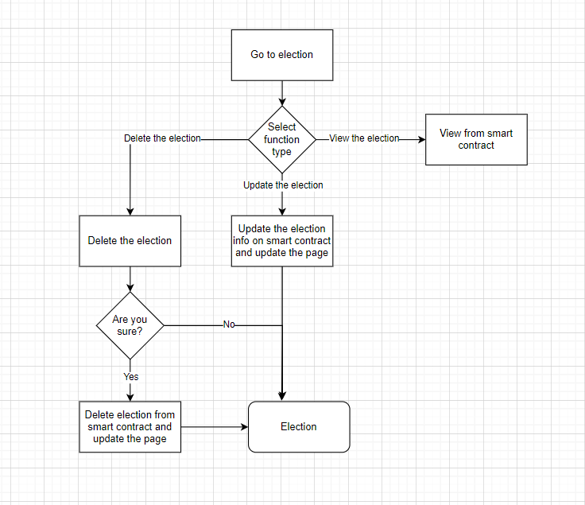
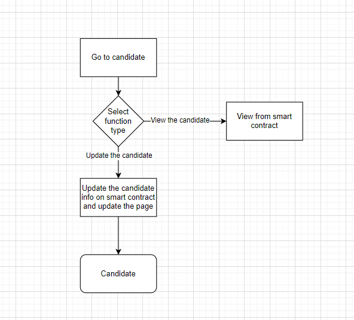

# Agora Blockchain

## Contributions by [Yogendra Jhala](https://gitlab.com/Yugg007)

## Links

- Project - https://gitlab.com/aossie/agora-blockchain
- Project is live on - https://moonlit-sprinkles-73dc0f.netlify.app/auth

## Agora Blockchain

**Agora** is a library of voting algorithms like `Moore's`, `Oklahoma` etc. Some of these voting algorithms are already implemented by **AOSSIE** in a centralized manner using Scala as their backend. Our vision is to take these algorithms on a decentralized platform, so that, crucial votes of the voters could not be tampered with by admins, hackers, or anyone with access to the database. Blockchain technology would make the ballots immutable and hence more secure.

---
### Use case modeling

I have identified the following tasks in the project at the start of the project.

1. Implementation the three voting algorihtm - Schulze, Instant Run Off, Kemeny Yound - **Done**
2. Integrating the above voting algorithm with the frontend in ReactJS. - **Done**
3. Designing the structure of code to implement the diamond structure(EIP 2535) into our Dapp. - **Done**
4. Implement the diamond structure with backend in solidity. - **Done**
5. Integrate the diamond structure with frontend in ReactJS -  **Done**
6. Designing open and invite-based elections. - **Done**
7. Creation of smart contracts for open and invite-based elections. - **Done**
8. Integrate and Testing the open and invite based elections with frontend in ReactJS. - **Done**
9. Implement and write smart contract for CRUD Operation to election/candidate. - **Done**
10. Test the contracts and the entire workflow. - **Done**
11. Implement the login/logout feature with the use of cryptographic hash(SHA256 function) to password. - **Done**
9. Documenting code for better understanding to future developers. - **Done**

---
### Technical aspect of frontend and backend

For developing the front end of the code and integrating it with blockchain (backend), below mentioned tech stack has been used.

- [Node.js](https://nodejs.org/en/) - Provides the package manager used in this project
- [Hardhat](https://hardhat.org/) - Hardhat is a development environment to compile, deploy, test, and debug your Ethereum software.
- [ReactJS](https://reactjs.org/) - Our frontend is built using ReactJS. React makes development easy to follow and learn and has efficient state management mechanisms.
- [Solidity](https://docs.soliditylang.org/en/v0.8.17/) - Solidity is an object-oriented, high-level language for implementing smart contracts. Smart contracts are programs which govern the behaviour of accounts within the Ethereum state.
- [MetaMask](https://metamask.io/) - MetaMask is a software cryptocurrency wallet used to interact with the Ethereum blockchain.
- [Heroku](https://www.heroku.com/) - Heroku is a platform as a service (PaaS) that enables developers to build, run, and operate applications entirely in the cloud. We use the Heroku service to deploy our front end.
- [Avalanche](https://www.avax.network/) - Avalanche is an open, programmable smart contracts platform for decentralized applications. Due to its EVM compatibility, high throughput, low transaction fees, and good community support, we choose this network to deploy our smart contracts (backend).

---
# Summary and Agenda
### Adding three new voting algorithm
**Schulze method** : An electoral system that selects a single winner using votes that express preferences.
**Instant Runoff Voting (IRV)** : An electoral system that uses ranked voting to elect the majority choice in single-member districts.
**Kemeny–Young method** : An electoral system that uses preferential ballots and pairwise comparison counts to identify the most popular choices in an election.

### Add Diamond Structure([EIP 2535](https://eips.ethereum.org/EIPS/eip-2535))
The Diamond Standard is a new structure that strengthens communication between multiple contracts through code function calls known as Delegate Calls as well as using Diamond Library(I have used dimond structure for function call). A contract that uses the external functions of other contracts (also called “facets”) is known as a ‘Diamond.’ Once deployed, several facets can be added, updated and removed in the future only through governance. This proposal standardizes diamonds, which are modular smart contract systems that can be upgraded/extended after deployment, and have virtually no size limit. More technically, a diamond is a contract with external functions that are supplied by contracts called facets. Diamond storage is a contract storage strategy that is used in proxy contract patterns and diamonds. It greatly simplifies organizing and using state variables in proxy contracts and diamonds.

###### Architecture of backend with diamond structure

### CRUD Operation to election and candidate
###### Election flow chart

###### Candidate flow chart

### Open and Invite Based Election
An open election is a type of election where any eligible voter can participate, regardless of their political affiliation or whether they have been invited to participate. In contrast, an invite-based election is a type of election where only voters who have been specifically invited to participate are allowed to vote. Invite-based elections can be used in situations where it is important to control the pool of voters, such as in private organizations or clubs. In an invite-based election, the organizers of the election can use various methods to invite voters, such as sending invitations via email or postal mail. It is important to note that the specific details of how open and invite-based elections are conducted can vary depending on the context and the rules set by the organizers of the election.

---
## Phases of development (GSoC 2021)

### Community bonding period (May 20 - June 12)

During the community bonding period, we discussed our regular meeting schedules for the coming days, technologies to be used, development, and deployment strategies. We identified our tasks to be done in GSoC'23, so that, we could get a headstart from the first week of the coding period. It didn't involve any coding work, rather we have to get in touch with our mentors and fellow developers and learn more about the organization.

The workflow was divided as:
- Phase 1
    - Client-side
        - Add voter modal for Schulze, Instant Run Off, Kemeny Young Algorithm.
        - Integrate diamond structure with frontend in ReactJS.
    - Backend side
      - Restructure backend with the SOLID principle
      - Implemented and tested all three voting algorithms.
      - Restructure backend to implement diamond structure. Provide upgradability and encapsulation to backend and also provide the functionality to add, remove and replace the function from backend(Done by ORG).
- Phase 2
    - Client side
        - Provide option to choose the election type Open or Invite Based Election. 
        - Implement four modal for to Update Election Info, Delete Election, Update Candidate Info and modal for to invite voter.
        - Fix Election Stats.
        - Provide vallidation to election modal.
    - Backend side
        - Implemented the feature in smart contract for to apply CRUD Operation on election and candidate.
        - Add feature to have functionality of open and invite election.
        - Add login and logout feature.

### Phase 1 (29 May 2023 - 10 July)

I worked on the following tasks during the first phase - 
1. Started writing the smart contracts for the three voting algorithm
2. Tested all three voting algorithm. 
3. Integrate this alorithm with frontend using ReactJS.
4. Integrated the frontend with the smart contracts.
5. Shared my work with my mentor and worked on the feedback.
6. Restructure the backend for the diamond structure
7. Implemented the diamond structure(`EIP 2535`) with backend.
8. Testing the diamond structure with `hardhat`, `chai` and `mocha` library.
9. Integrate the diamond structue with frontend.
9. Integrated the front end and the back end using `ethers.js`.
10. Complete left over work.
11. Shared my work with my mentor and worked on the feedback.

### Phase 2 (14 July - 21 August)

I worked on the following tasks during the second phase -
1. Enhanced and upgrade the smart contract for to have functionality of CRUD Operation on election and candidate.
2. Integrate this CRUD functionality to frontend in ReactJS.
3. Shared my work with my mentor and worked on the feedback.
4. Implement the smart contract to have open and invite based election.
5. Integrate open and invite based election.
6. Fix Election stats and provide validation to create election modal.
3. Implement the new functionality of login and logout, provide efficient(remove gas consumption and reduce by 80%) and secure solution with SHA(256) hashing algorihm(for password) and use localStorage.

---
### Challenges we faced

Things are not always like what you expected. While working on this project, we experienced this a lot. It is always a good practice to keep a few slots in the buffer for debugging purposes, just in case, something went wrong. The challenges that we ran into are listed below -
1. **Insufficient open-source projects on Diamond Structure** - One challenge I faced during developer when integrating the Diamond structure (EIP-2535) into an existing smart contract is the lack of proper documentation. The Diamond Standard is a relatively new approach to building upgradeable smart contracts, and as such, there may not be as much documentation and guidance available as there is for more established approaches. This can make it difficult for developers to understand how to properly implement the Diamond structure and integrate it into their existing smart contract. Developers may need to spend additional time researching the Diamond Standard and experimenting with different approaches to find the best way to integrate it into their existing contract. This can be a time-consuming and challenging process, especially if the developer is not familiar with the Diamond Standard.
 
2. **Improper description of algorithm available** - One challenge that developers may face when implementing voting algorithms such as the Schulze method, Instant Runoff Voting (IRV), or the Kemeny-Young method into a smart contract is the lack of proper documentation. These algorithms can be complex and may require a deep understanding of their underlying principles and mechanics in order to be implemented correctly. If there is not enough documentation available, or if the documentation is unclear or incomplete, developers may have difficulty understanding how to properly integrate these algorithms into their smart contract. This can result in errors, vulnerabilities, or unintended behavior in the contract. To overcome this challenge, developers may need to spend additional time researching these algorithms and experimenting with different approaches to find the best way to integrate them into their existing contract. This can be a time-consuming and challenging process, especially if there are not many examples or resources available to help guide them

---
### Acknowledgements

Finally, I would like to thank my mentor **Kirti Lodha** and the entire organization  **Bruno Woltzenlogel Paleo** for helping us out whenever we were stuck in challenges and needed some experienced person to bring us to track.

I would like to thank my peer programmer **Kumar Harsh**, without whom this project was nearly impossible to complete in the stipulated time.

I hope our contributions to this project were valuable and would help someone who wants to get started with Blockchain, and Solidity, and could set some references for `Diamond Structure`, `Open/Invite Based Election`. We could help organise internal elections in colleges, schools etc. One more interesting use case is in the DAO space, where we could help blockchain organizations to take governance decisions on community proposals. 

---
### Merge Requests

1. [Merge request! 119](https://gitlab.com/aossie/agora-blockchain/-/merge_requests/119) - **Open**
   
   - Implemented three voting algorithm.
   - Integrated backend with the frontend.
   - Add election modal for all algorithm.

2. [Merge request !125](https://gitlab.com/aossie/agora-blockchain/-/merge_requests/125) - **Open**
    - Implement EIP 2535(Diamond Structure) with backend and Integrate with frontend.

3. [Merge request !118](https://gitlab.com/aossie/agora-blockchain/-/merge_requests/118) - **Open**
    - Implement CRUD Operation to election as well as to candidate and Integrate to frontedn in REactJS.
    - Implement on Open/Invite Based Election feature to smart contract and Integrate to frontend.
    - Fix UI and UX of overall DAPP.
4. [Merge request !121](https://gitlab.com/aossie/agora-blockchain/-/merge_requests/121) - **Open**
    - Add Login and Logout feature to Dapp.
    - Used hashing algorithm to secure store the credential.

